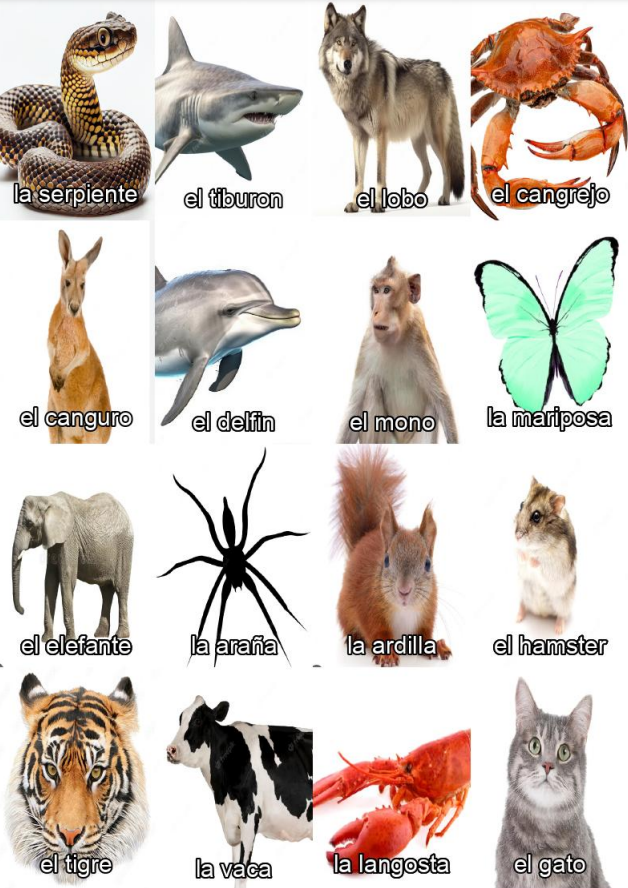

# Bingo
## Why?

As a Spanish teacher, I want to play bingo with my students as often as possible. However, I didn't want to spend a lot of time making 30 distinct boards. This is why I automated the process.

## How does it work?

The script needs a directory with the images to be used for the _flaschards_ and the _boards_. Further, each image needs to be named with the word(s) you want to be written under the image (both in the _flashcards_ and in the _boards_). If you want to use more than one word, use underscores \_ instead of whitespaces (e.g. \"el_perro.png\").

You need to specify the path for the directory in `main.py` as well as the number of boards that you want be generated. 

### Other considerations

The script uses the font arial.ttf as a default (which is included in the repo). Feel free to change it but don't forget to change it in the code!

## Instalation

The usual:
`git pull https://github.com/zomvie-break/bingo.git`

(SUGGESTED) I recomend you create a virual enviroment in the directory before you install the requirements (i.e `python -m venv ./<name_of_venv>`). Then select the interpreter (e.g. `source ./<name_of_venv>/bin/activate`)

Install the requirements: run `pip install -r requirements.txt`

Finally, change the first line of code in the `main.py` (e.i. the shebang, #!) to the path of your python interpreter (if you used a virtual environment, this would be in `/<name_of_venv>/bin/python3`)

## Usage

Once you your images in a specific directory and you made the changes to the `main.py` file, you can now run the script. You might need to change the file permissions `chmod +x ./main.py` to make it executable. 

Simply run `./main.py` from the terminal.

## Samples

### Board samples

### Card sample

Enjoy!
